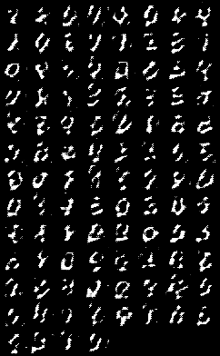

# Generative Model

Implementation of GAN model with torch for 'Machine Learning 2' course, on the MNIST dataset.

## Notebook Contents:

- Model architecture
- Training
- Disscussion
    - Architecture
    - Visualization of the latent space
    - Convergence plots
    - Generated samples 
- Code for recreating our results

## Results Demonstration:

For example, the improvement of our generated images after training in 20-epochs intervals (up to 100 epochs):

